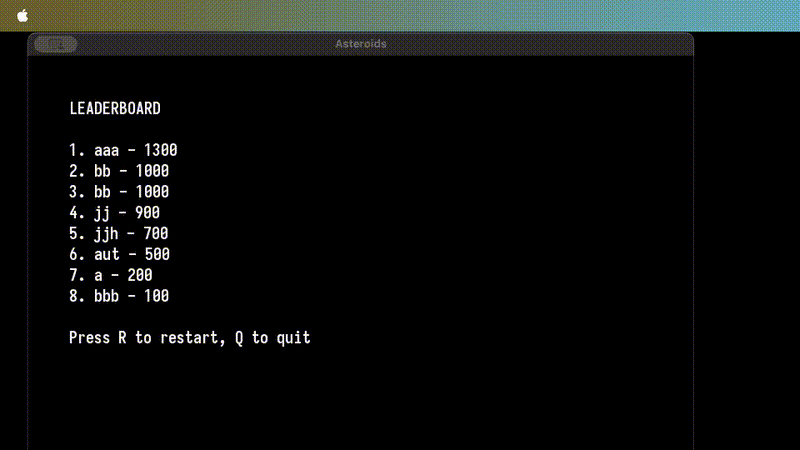

# README.md

The project was completed as a final project for CS 6010 at the University of Utah, in collaboration with Owen Brown (GitHub: OBrown426).

## Project Overview

This is an Asteroids game implemented in C++ using SFML. 

## Demo



## Game Features

- **HP System**: Ship has 3 hit points, loses 1 HP per asteroid collision
- **Invincibility**: 2-second invincibility period after taking damage with 1-second visual shimmer effect
- **Asteroid Physics**: Large asteroids split into 2 smaller ones when hit, small asteroids disappear
- **Score System**: Earn points by destroying asteroids with lasers
- **Game Over & Leaderboard**: Enter 3-character name and view top scores when HP reaches 0

## Installation and Setup

### Prerequisites

**Required:**
- CMake 3.8 or higher
- C++20 compatible compiler
- SFML 2.6 (graphics, system, window components)

### Installing SFML

#### macOS (Homebrew)
```bash
brew install sfml
```

#### macOS (MacPorts)
```bash
sudo port install sfml
```

#### Ubuntu/Debian
```bash
sudo apt-get update
sudo apt-get install libsfml-dev
```

#### Fedora/CentOS/RHEL
```bash
# Fedora
sudo dnf install SFML-devel

# CentOS/RHEL (with EPEL)
sudo yum install epel-release
sudo yum install SFML-devel
```

#### Arch Linux
```bash
sudo pacman -S sfml
```

#### Windows (vcpkg - Recommended)
```bash
# Install vcpkg first, then:
vcpkg install sfml:x64-windows
```

#### Windows (Manual)
1. Download SFML 2.6 from https://www.sfml-dev.org/download.php
2. Extract to `C:\SFML` (or preferred location)
3. Set environment variables or specify paths in CMake

### Building the Game

```bash
# Clone the repository
git clone <repository-url>
cd Asteroid

# Build the project
mkdir build && cd build
cmake ..
make

# Run the game
./bin/asteroids
```

### Controls

- **Arrow Keys**: Rotate ship (Left/Right) and thrust (Up)
- **Spacebar**: Shoot lasers
- **Game Over Screen**: Press Space to enter name
- **Name Input**: Type 3 characters, press Enter to save
- **Leaderboard**: Press R to restart, Q to quit

## Development Commands

```bash
# Build the project (from root directory)
mkdir build && cd build
cmake ..
make

# Run the game (from build directory)
./bin/asteroids

# Clean build (from root directory)
rm -rf build
```

## Build Configuration

The CMakeLists.txt is configured to:
- Output executable to `bin/` directory
- Copy `images/` folder and font file to build directory automatically
- Enable compile commands export for IDE support
- Use debug build type with AddressSanitizer and UBSan enabled
- Require SFML 2.6 components: graphics, system, window

## Asset Requirements

**Font (Required):** `IosevkaNerdFont-Bold.ttf` must be in root directory
**Images (Required):** All located in `images/` directory:
- `spaceship.png` - Player ship sprite
- `laser.png` - Laser projectile sprite  
- `asteroid_04.png`, `asteroid_05.png`, `asteroid_06.png` - Asteroid sprites

## Common Issues

**SFML Not Found:** Ensure SFML 2.6 is installed and CMake can find it. The build will fail with clear error if SFML is missing.
**Missing Assets:** Game will crash if font or image files are missing. All assets are automatically copied to build directory.
**Sanitizer Errors:** AddressSanitizer and UBSan are enabled by default for debugging. Disable in CMakeLists.txt if needed.

## Code Architecture

### Core Classes

**Game Class** (`src/game.cpp`, `include/game.h`)
- Main orchestrator with game state management (PLAYING, GAME_OVER, NAME_INPUT, LEADERBOARD)
- Handles collision detection between ship-asteroids and laser-asteroids
- Manages leaderboard storage in `leaderboard.txt`
- Fixed window size: 800x600 pixels

**Ship Class** (`src/ship.cpp`, `include/ship.h`)  
- Inherits from `sf::Drawable` and `sf::Transformable`
- HP system (3 HP), invincibility (2s), and shimmer effect (1s)
- Collision detection uses `checkCollision(const Asteroid &asteroid)`
- 400ms laser firing cooldown

**Asteroid Class** (`src/asteroid.cpp`, `include/asteroid.h`)
- Large asteroids: 50x50px, Small asteroids: 25x25px
- `breakApart()` function splits large asteroids into 2 small ones
- Uses `getBounds()` for collision detection (applies transforms)

**Laser Class** (`src/laser.cpp`, `include/laser.h`)
- Simple projectile with boundary cleanup
- Speed: 300 units/second

### Key Patterns

- **Entity Management**: Vector-based collections for asteroids/lasers
- **Collision Detection**: Uses SFML's `FloatRect.intersects()` with proper transforms
- **State Machine**: Game states control input handling and rendering
- **Smart Pointers**: `unique_ptr<Texture>` for automatic memory management

### Important Implementation Details

**Collision Detection:** Ship-asteroid collisions use `asteroid.getBounds()` not `asteroid.getSprite().getGlobalBounds()` to account for scaling transforms.

**Game States:** Input handling changes based on current state. Name input has 0.2s delay after transitioning from GAME_OVER to prevent accidental space input.

**Asset Loading:** Textures loaded via `loadTextures()` function, stored as `vector<unique_ptr<Texture>>`, and automatically copied to build directory.